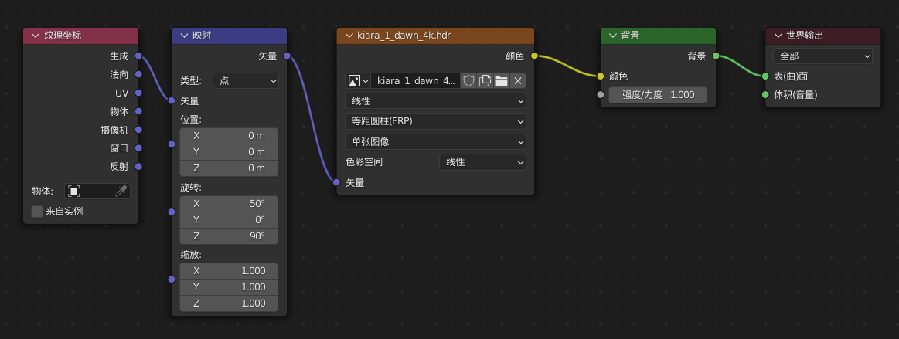

## blender材质篇

材质主要靠**四张贴图**解决。

**漫反射贴图（Diffuse）**：记录物体表面的颜色和纹理。这是一张照片。相当于素描里黑白灰，先给物体一个基本定义，黑的，还是白的、灰的，然后再加强。色彩空间保持原样。

**粗造度贴图（Roughness）**：记录物体表面的粗糙程度。指水平方面的，物体表面松弛，自然会粗糙，反射就会弱，就会暗。表面贴的紧，自然会光滑，反射就会强。色彩空间记得选Non-Color。

**法线贴图（Normal）**：记录物体表面上下的凹凸程度，也可以说是粗糙程度。这样物体的表面四个方向就都有了(水平、上下)。这张贴图还是一张贴图，物体表面没有实际变化，只是看起来变化了。色彩空间记得选Non-Color。

**置换贴图（Displacement）**：真实的凹凸变化。它是法线贴图的加强版，会增加模型数目。使模型切实发生改变，而不是像法线贴图只那样是看起来变了，实际上，没有发生任何变化，它只是一张贴图。通常情况下，前三种图就够用绝大部分的情况了。在修改器里添加置换修改器。权重绘制编辑顶点组，使不必要的面不会置换。色彩空间记得选Non-Color。

这个的要求是必须有这四种贴图。才能取得比较真实的材质。这个方法胜在容易操纵，理解。把四张贴图贴好就行，尤其是你有美术基础的时候。当然，技术在进步，blender提供了一些快速材质，比如金属、玻璃。未必一定、全部，非要极度贴近真实。其实配合漫反射贴图和一些参数调节，已经让人能一眼认出是什么材质了，不会让人产生误解。很多情况已经够用了，在一些领域，我们生产的是产品，不是艺术品。精雕细琢提升的收益很小。

## 添加HDR背景
添加HDR环境纹理
纹理坐标 > 映射

